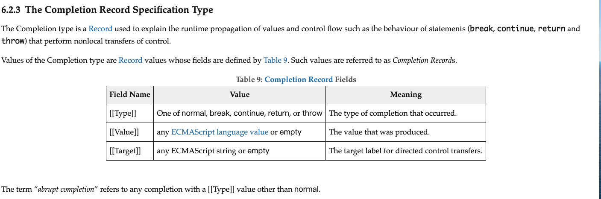

# 如何阅读ECMAScript

### Language Type（语言类型）和 Specification Type（规范类型）

>  ECMASScript规范内部会创建一些类似于对象的东西来按照特性形式存储数据。
>
> 而规范类型就是指**仅限于规范文档内部使用的一些数据类型**，我们创造这种数据类型的目的将同种类的数据结构抽象起来，便于复用。比较重要的规范类型有：List、Record、Completion Record、Reference、Property Descriptor、Environment Record 等。

- List列表

  JS 中函数的参数 arguments，实际上在规范内部就是借助 [List](https://link.zhihu.com/?target=https%3A//tc39.es/ecma262/%23sec-list-and-record-specification-type) 这一规范类型来创建的。类似的，JS 中的 Set、Map 这样的有序结构本质上也依赖 List 来保证它内容的有序性。

  在规范当中，List 有它自己的一个字面量写法，形如 `« 1, 2 »`，它表示一个 List，它的第一位值是 `1`、第二位值是 `2`。

- record记录

  [Record](https://link.zhihu.com/?target=https%3A//tc39.es/ecma262/%23sec-list-and-record-specification-type) 规范类型其实就类似于 Object 这种语言类型，它像对象的属性那样，具有若干 named fields（命名字段），这个 field 名称必须用两组方括号括起来。我们可以使用 `{ [[Field1]]: 42, [[Field2]]: false, [[Field3]]: empty }` 这样的字面量写法来表达一个 Record。而在访问的时候，用的是 `R.[[Field2]]` 这样的形式，它是意思是访问 `R` 这个 Record 的 `[[Field2]]` field。**Record 的 field 是无序的，而且它不像 JS 对象那样有原型继承，对于一个 Record 来说，它只能带有明确列出来的 field。**

  请注意，这种 `[[ ]]` 双方括号写法可不是 Record field 的专利，规范中，**Internal Method（内部方法）** 和 **Internal Slot（内部槽）** 也是用双方括号括起来的，它们的区别之后会讲到。

​    

### Internal Method（内部方法）和 Internal Slot（内部槽）

我们知道编程语言中对象有属性和方法，在 ES 规范的内部，对象拥有一系列的 [Internal Method（内部方法）和 Internal Slot（内部槽）](https://link.zhihu.com/?target=https%3A//ecma262.docschina.org/%23sec-object-internal-methods-and-internal-slots)。

**Internal Method（内部方法）**是规范用来定义对象自身的行为逻辑的一种算法。比如我们要读取 o 对象的 p 属性，我们写 JS 代码的话会是 `o.p` 或者 `o["p"]`，无论是写哪种代码来读取，这个代码的**语义（semantic）**是一样的，因此它会执行这个语义所对应的 Internal Method。比如读取对象属性的 Internal Method 叫做 [[Get]]，它接受的参数是 propertyKey 和 Receiver。调用 [[Get]] 就像调用一个方法，用括号来表示调用，然后括号中写参数，所以它内部的执行的就是 `o.[[Get]](p, o)`。这里它的**语义**就是「读取 o 对象的 p 属性」。

（Receiver 在我们写 JS 的 Proxy 时也会接触到，如果你对 Receiver 感到疑惑，没关系，本系列的后续文章（也许）会讲到这个知识点，此处我们先跳过。）

Record 的 field 和 Internal Method、Internal Slot 都是使用双方括号，那应该怎么区分呢？区分方式就是看它的语境：如果前面是 Record，那么后面跟的 [[xxx]] 就是这个 Record 的 field；**如果前面是对象，比如 `O.[[xxx]]()` ，由于使用了括号去执行，因此它是 Internal Method；如果只是单纯 `O.[[xxx]]` 那就是 Internal Slot。**

Internal Method（内部方法）执行的返回值是 Completion Record（完成记录），这个后面会讲。

**Internal Slot（内部槽）**用于在对象上记录状态、数据。

Internal Method 和 Internal Slot 都是 ES 规范内部的概念，因为我们不能通过 JS 来访问、调用它们。对于 JS 语言实现来说，规范也不要求具体实现的逻辑、步骤、算法和规范的 Internal Method 一模一样，它仅要求实现表现出来的特性、结果和规范一致即可。

规范还给对象、函数定义了一套所谓的 **Essential Internal Methods（基本内部方法）**。

### Essential Internal Methods（基本内部方法）

[Essential Internal Methods（基本内部方法）](https://link.zhihu.com/?target=https%3A//tc39.es/ecma262/%23table-essential-internal-methods) 是 ES 规范给对象定义的一系列最基本的、必不可少的内部方法，它决定了对象的基本的、默认的行为逻辑。

规范中规定，当一个对象拥有 [[Call]] 内部方法时，就可以称之为是 function object（函数对象）。当一个函数对象拥有 [[Construct]] 内部方法时，就可以称之为 constructor（构造器）。也就是说，构造器是一种特殊的函数，而函数是一种特殊的对象。函数对象和构造器具有额外的 [基本内部方法](https://link.zhihu.com/?target=https%3A//tc39.es/ecma262/%23table-additional-essential-internal-methods-of-function-objects)。

如果一个对象（包含函数对象和构造器）的所拥有的基本内部方法的表现行为和 [9 Ordinary and Exotic Objects Behaviours](https://link.zhihu.com/?target=https%3A//tc39.es/ecma262/%23sec-ordinary-object-internal-methods-and-internal-slots) 所定义的完全相同，就意味着这样的对象是 **ordinary object 常规对象**。

如果一个对象的表现行为和以上述定义有所不同（哪怕只是有一处差异），就意味着它是 **exotic object 异质对象**。

>  请注意，不是说 exotic object 它不具备 Essential Internal Methods。Essential Internal Methods 是每个对象都会必备的，只是 exotic object 带有特殊的内部方法，它覆盖了默认的 Essential Internal Methods 而已。

### completion record完成记录

[Completion Record](https://link.zhihu.com/?target=https%3A//tc39.es/ecma262/%23sec-completion-record-specification-type) 是一种特殊的 Record，用于表述流程运行到特定步骤时的运行结果，**ES 规范中可任何运行的步骤、语句都会显式或隐式地返回一个 Completion Record**，它具有特定的三个 field，如下图所示。

当 Completion Record 的 `[[Type]]` 是 normal 时，我们就成这个 Completion Record 是 **normal completion 正常完成**，否则，就称之为 **abrupt completion 中断式完成**。

访问 Completion Record 的值，或者说从 Completion Record 中取值，等效于是读取 Completion Record 中名叫 `[[Value]]` 的这个 field 的值。当然前提是这个 Completion Record 不能是 abrupt completion。

搞这种 Completion Record 的好处是什么呢？**因为规范中涉及太多操作逻辑的调用，必须设计出一种良好的异常处理机制，使得规范文档能够简洁明确地处理异常。**我们知道，如果在写代码时嵌套了很多层 try-catch 结构，那么代码的可读性会非常差，外部感知不到内部出了什么错，因为内部的异常可能被 catch 掉了。ES 规范也会遇到相同的问题，尤其是 ES 所描述的流程是一种规范层面的抽象流程，它不是实际的程序代码，因此它必须即时的处理异常，而不能「生吞」它。

有了 Completion Record 这种规范类型之后，它不仅携带了运行结果（[[Value]]），它可以兼容错误情况，如果当前步骤遇到错误的时候（也就是 abrupt completion 的时候）就可以直接显式地处理它，也可以让错误一层一层向外冒泡，并且如果是 break 或者 continue 的话，那也能自说明地表达出接下来的运行位置。

这样一来我们就省略掉 try-catch 语句，所以这就是 ES 规范使用 Completion Record 来处理错误的原因。当然这是规范内部定义的一种概念，不代表在实现的时候也要照搬这一套。

接下来简单演示一下 Completion Record 使用，思路是一个固定套路的三板斧，假设我们有一个叫做 `doAbstractOperation` 的操作步骤：

1. 令 `completionRecordResult` 为 `doAbstractOperation()` 的结果。
2. 如果 `completionRecordResult` 是 abrupt completion，则直接返回 `completionRecordResult`。
3. 读取 `completionRecordResult.[[Value]]` 的值，赋值给 `result`。

这样一来我们就能安全地获取结果 `result`，而且我们能够保证，只要我们拿到了 `result`，它就一定是正常值，因为如果遇到错误的话，在它之前就会直接退出。可能有些思维缜密的人会问，那么如果第三步出错咋办？如果 `completionRecordResult` 不含 `[[Value]]` 呢？实际上，它一定会含有 `[[Value]]`。因为 Completion Record 可以在规范的操作中**隐式返回**，它实际上确保了返回值一定包装在一个 Completion Record 结果中。由于我们第二步就扔出了 abrupt completion，所以根据定义，所有能够走到第三步的 Completion Record 都是 normal completion，都有具有 `[[Value]]`，因此这个访问过程是安全的。

当然，如果我们真的去这么使用 Completion Record 的话也会很麻烦，这意味每一次获取一个 Completion Record，都要做判断，都要写这三行逻辑，如果是 abrupt completion 就直接返回它，若是 normal completion 就取出其中的 `[[Value]]`。遇到重复的操作步骤，我们显然应该将其提炼成一个共通步骤，然后引用它即可。这就形成了我接下来要讲的 `ReturnIfAbrupt`。

### returnAbrupt

有了之前的基础，ReturnIfAbrupt 就非常好理解了。它是一种为了**简化规范的算法步骤而发明的的简写方式**。ReturnIfAbrupt(completionRecordResult) 就是我们刚才说的，在遇到 Completion Record 时，「如果是 abrupt completion 就直接返回它，若是 normal completion 就取出其中的 `[[Value]]」`。由于执行抽象操作会生成 Completion Record，因此也就相当于是 ReturnIfAbrupt(doAbstractOperation())。

不过请千万注意一点，**绝对不能将 ReturnIfAbrupt 当作一个函数来理解**，因为它在执行 return 时，不是从 ReturnIfAbrupt 的结构体内部 return 出来（它压根就没有结构体）（这里我觉得意思就是说没有在函数栈上加上这个ReturnIfAbrupt函数，就是在原地返回的），而是在 ReturnIfAbrupt 所在的位置原地 return 到当前步骤的外部。因此它的特性不像函数，更类似于是一种 C 语言的宏（可运行的字符串）。

有了 ReturnIfAbrupt 这个简写之后，原本我举的例子 doAbstractOperation 要用三行才表述出来的逻辑被压缩成一个简短的 ReturnIfAbrupt(doAbstractOperation())。

然而，在实际规范中，ReturnIfAbrupt 出现的频率不那么高，因为我们有一套更加优秀的简写，问号简写标记「?」和叹号简写标记「!」。

### 问号简写标记「?」和叹号简写标记「!」
问号简写标记「?」 是一个前缀符号，它后面跟着一个空格，然后跟着操作名称。比如 ? doAbstractOperation()，它完全等价于 `ReturnIfAbrupt(doAbstractOperation())`，它表示如果这个操作结果是 abrupt completion，则在 ? doAbstractOperation() 这个位置原地把 abrupt completion 给 return 出去；如果操作结果是 normal completion，则提取它内部的 `[[Value]]` 出来，作为整个 ? doAbstractOperation() 结果。

叹号简写标记「!」和「?」有点类似，唯一的区别在于**它是一个隐式断言assert**，它断言此处执行的逻辑永远不会出现 abrupt completion，永远只会拿到 normal completion。! doAbstractOperation() 的结果就是这个 normal completion 的 `[[Value]]`。

OK，理解了的用法后，我们结合规范来看一看。还记得我们上文讲到的规范中抽象操作 Number.prototype.toString 吗？它在第一步 1. Let x be ? thisNumberValue(this value). 中使用了问号简写标记「?」和抽象操作 thisNumberValue，它用问号标记的原因在于 thisNumberValue 确实有可能会抛出一个异常。

### 参考链接

[ECMAScript阅读指南（二）](https://zhuanlan.zhihu.com/p/262265857)