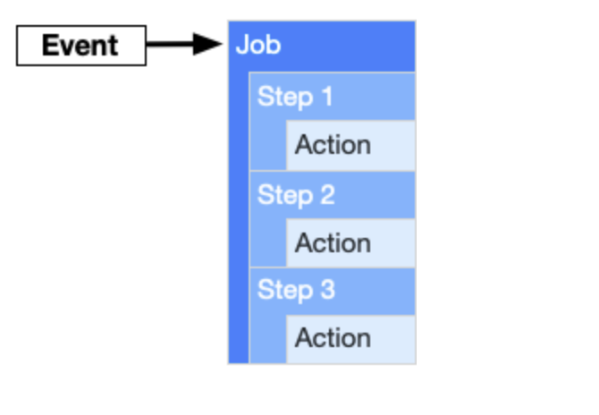
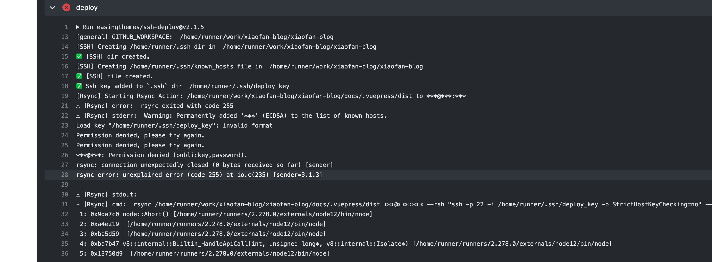

# github actions

最近又想重新把个人博客给捡了回来，与之前不同的是我这次想有一个自动化的部署流程（之前也是没有CI/CD所以放弃了）。借着这个机会，我整理了下关于github actions的一些用法。

### 一些概念

- workflow的模型：通过事件驱动，执行多个任务（job）。


- 任务之间可以是串行，或是并行。另外任务中可以有多条step。

整个流程就是事件触发workflow。workflow中的会有多个任务（🌰：自动化测试、自动化部署），每个任务中会有多个actions，这些actions可能是多条命令的集合。

- runner：在一次workflow中，可以指定多个任务。每个任务也可以指定自己的执行器也就是runner

- steps：每个步骤可以是一个脚本命令，或是一个actions（actions实际上就是独立的脚本命令集，这个我们可以用别人写的来部署些环境等）

- 一定要弄清楚environment secrets和repositories secrets

   environment secrets类似于局部变量的意思，如果局部变量中没有个值，则会去repositories secrets中去找。

   每个job都可以通过environment变量来指定对应的环境。

### 写一个workflow配置文件

配置文件是用yaml写的，文件在`.github/workflows/`下。

```yaml
# This is a basic workflow to help you get started with Actions
name: CI

# Controls when the action will run. 
on:
  # Triggers the workflow on push or pull request events but only for the master branch
  push:
    branches: [ master ]
  pull_request:
    branches: [ master ]

  # Allows you to run this workflow manually from the Actions tab
  workflow_dispatch:

# A workflow run is made up of one or more jobs that can run sequentially or in parallel
jobs:
  # This workflow contains a single job called "build"
  build:
    # The type of runner that the job will run on
    runs-on: ubuntu-latest

    environment: aliyun

    # Steps represent a sequence of tasks that will be executed as part of the job
    steps:
      # Checks-out your repository under $GITHUB_WORKSPACE, so your job can access it
      - uses: actions/checkout@v2

```
整个配置文件大概就是这样。
定义该workflow的一些属性，例如名称，触发条件。

然后定义job，比如说这个job是一个build任务，分配给github的云服务器（对了这里可以白嫖）。
云服务器就执行下面一条条命令了。

我这里就简单讲下我踩的坑：

1. 安全问题，比方说你想隐藏自己的服务器。你就得声明一个环境变量。这个环境变量需要在该仓库内命名好，并在本次步骤或任务中注册。
**尤其要注意的是，repository变量和环境变量是不同的，如果要使用环境变量，你还需要指定环境）
```yaml
jobs:
  build:
      environment: aliyun
      steps:
        - name: echo
          run: echo "${name}"
          env:
            name: {{ secrets.name }}
```

当然所有人都是看不到这些变量的，如下图。


2. 在部署的时候，我使用了ssh-deploy这个actions库，他里面用到了`rsync`这个命令。所以你需要把ssh公钥和私钥先创建。
   公钥创建完成后，还需要写入到`~home/.ssh/authorized_keys`这个文件中。另外私钥就保存到这个变量中

```yaml
   # 部署
   - name: deploy
      uses: easingthemes/ssh-deploy@v2.1.5
      env:
         SSH_PRIVATE_KEY: ${{ secrets.SERVER_SSH_KEY }}
         ARGS: "-rltgoDzvO"
         SOURCE: "docs/.vuepress/dist"
         REMOTE_HOST: ${{ secrets.REMOTE_HOST }}
         REMOTE_USER: ${{ secrets.REMOTE_USER }}
         TARGET: ${{ secrets.REMOTE_TARGET }}
```

### github托管器（我就是有钱，就要用自己的服务器）

1. 先要增加一个workflow后再配置运行器

2. add 子托管runner，在执行`config.sh`文件时，要注意先声明一个环境变量。否则shell这个语句会进入if分支。

```sh
if [ $user_id -eq 0 -a -z "$RUNNER_ALLOW_RUNASROOT" ]; then
    echo "Must not run with sudo"
    exit 1
fi
```

3. 开启服务

   我们需要将该进程挂到后台。[配置服务](https://docs.github.com/en/actions/hosting-your-own-runners/configuring-the-self-hosted-runner-application-as-a-service)

   查看该runner进程`./svc.sh status`

4. 在workflow的配置文件中我们需要去启用该台运行器。

### 参考

[添加子托管的运行器](https://docs.github.com/cn/actions/hosting-your-own-runners/adding-self-hosted-runners)

[给运行器打标签](https://docs.github.com/cn/actions/hosting-your-own-runners/using-labels-with-self-hosted-runners)

[github-actions语法](https://docs.github.com/en/actions/reference/workflow-syntax-for-github-actions)